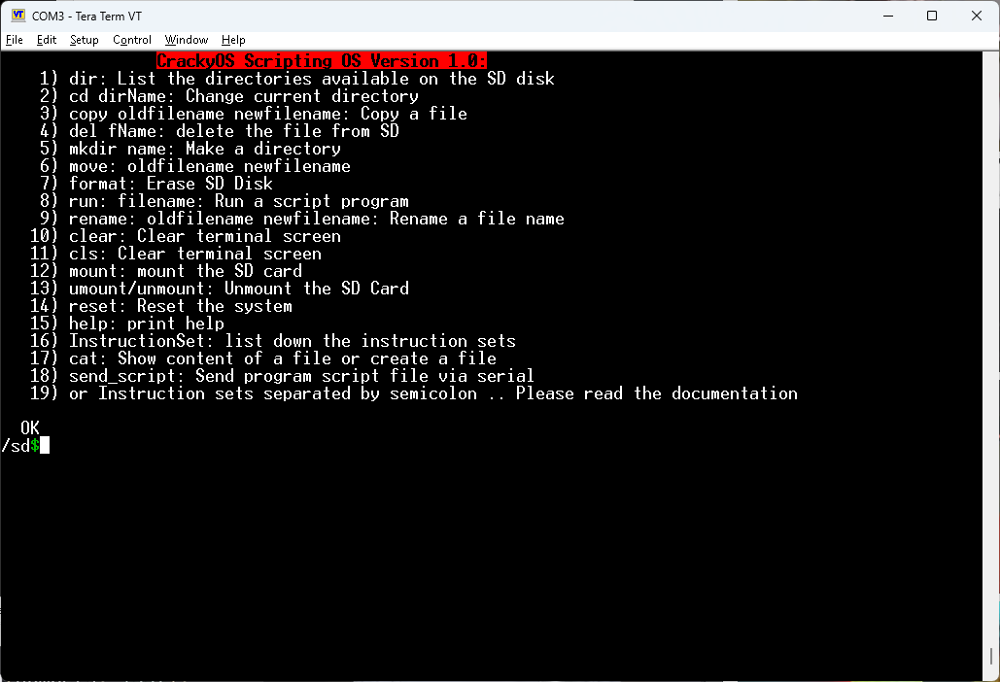

#  CrackyOS

**CrackyOS** is an embedded operating-system project built on top of **Mbed OS Community Edition (Mbed OS CE)**. It provides a lightweight command interpreter that allows scripts and individual commands to be executed directly on an embedded device.

Scripts can be loaded from an **SD card**, entered interactively through a **serial terminal**, or transferred over the terminal and automatically stored on the SD card for later execution.

The project is designed to provide a simple, extensible environment for interacting with the underlying embedded system without requiring firmware changes for every new command or operation.

The goal of this OS is **not speed**. Instructions are executed more slowly than compiled firmware, but the main goal is **easy and flexible prototyping**.

To add support for other hardware, you need to create two files, following the same structure used by the hardware currently supported. The hardware must also be supported by **Mbed OS CE**. At the moment, the project supports **four Nucleo boards**.

---
##  Interactive Interface  

## ✨ Features

* 🖥️ **Interactive command interpreter**

  * Execute commands individually through a serial terminal.
  * Enter an interactive mode for direct interaction with the device.

* 📜 **Script execution**

  * Execute scripts stored on an SD card.
  * Send script files over the serial terminal.
  * Automatically save transferred scripts to the SD card.

* 💾 **SD card support**

  * Read and execute scripts from the SD card.
  * Store scripts transferred through the terminal.
  * Perform various SD card and filesystem operations.
  * Includes an SD card formatting command when interactive mode is enabled.

* 📁 **Directory manipulation**

  * Create, remove, inspect, and manipulate directories and files through interpreter commands.

* 📝 **Text and file manipulation**

  * Commands for working with text and files directly from the interpreter.

* 🧩 **Mbed OS CE based**

  * Built on top of [Mbed OS Community Edition](https://github.com/mbed-ce/mbed-os).
  * Takes advantage of Mbed OS's hardware abstraction and embedded-system facilities.

* 📚 **Documentation**

  * API and source documentation generated with **Doxygen**.
  * A `Doxyfile` is included in the repository.
  * Generated HTML documentation can be found in the documentation directory.

* 🧪 **Examples**

  * Example scripts and usage demonstrations are provided in a dedicated examples directory.

*
---

## 📂 CrackyOS Structure

```text
.
├── cracky_scripts/       # Example scripts
├── CrackyOS/             # CrackyOS source code and build scripts
├── documentation/        # HTML documentation
├── images/               # Useful hardware images
├── schematic/            # SD card schematic
├── Doxyfile              # Doxygen configuration
└── ...
```

---

## 🔨 Build & Deploy

The project includes build scripts for both **Windows** and **Linux/macOS**:

* `.bat` scripts for Windows
* `.sh` scripts for Linux/macOS

Simply run the appropriate build script for your environment to compile the project.

A separate **deployment script** is also provided to deploy the compiled firmware to the target board.

```text
Windows       → build.bat
Linux/macOS   → build.sh
Deploy        → deploy script
```

The scripts handle the required build steps, so no manual build commands are normally required.

---
